# InterviewMate - Process Flow Documentation

## 🔄 Complete User Journey & Process Flows

This document outlines all the key processes and user journeys in the InterviewMate platform, from user registration to interview completion and beyond.

## 🚀 User Onboarding Flow

### 1. Registration & Authentication Process

**Key Steps:**
1. **Landing Page**: User discovers InterviewMate
2. **Registration Choice**: Email/password or Google OAuth
3. **Account Creation**: Server validates and creates user record
4. **Welcome Process**: JWT token generation and welcome email
5. **Dashboard Access**: User redirected to main dashboard

### 2. Profile Setup & Preferences

## 🎯 Interview Creation & Setup Flow

### 1. Interview Setup Process

**Key Components:**

#### Step 1: Candidate Details
- **Basic Information**: Name, role, company, experience level
- **Resume Upload**: Optional PDF/DOC upload with AI parsing
- **Skill Extraction**: Automatic skill detection from resume
- **Manual Override**: User can edit auto-detected information

#### Step 2: Interview Context
- **Type Selection**: HR, Technical, Managerial, or Custom
- **Topic Selection**: Predefined topics based on interview type
- **Custom Topics**: User-defined focus areas
- **Job Description**: Upload or paste JD for context
- **Custom Questions**: User-specific questions to include

#### Step 3: Configuration
- **Mode Selection**: Lite (Web Speech) vs Pro (VAPI AI)
- **Balance Check**: Verify sufficient credits for Pro mode
- **Duration Setting**: 5-60 minutes
- **Question Count**: 5-20 questions
- **Difficulty Level**: Easy, Medium, Hard

### 2. AI Configuration Generation

## 🎤 Live Interview Process Flow

### 1. Interview Session Management

### 2. VAPI Mode Flow (Pro)

### 3. Web Speech Mode Flow (Lite)

### 4. Real-time Interface Updates

## 🤖 AI Evaluation Process Flow

### 1. Interview Evaluation Pipeline

### 2. AI Prompt Generation

### 3. Evaluation Scoring System

```mermaid
flowchart TD
    A[AI Evaluation Response] --> B[Parse JSON Response]
    B --> C[Validate Score Format]
    C --> D{Valid Scores?}
    D -->|No| E[Apply Default Scores]
    D -->|Yes| F[Normalize Score Ranges]
    
    E --> G[Calculate Overall Score]
    F --> G
    G --> H[Determine Performance Grade]
    H --> I{Grade Calculation}
    I -->|90-100| J[Grade: A+]
    I -->|80-89| K[Grade: A]
    I -->|70-79| L[Grade: B]
    I -->|60-69| M[Grade: C]
    I -->|<60| N[Grade: D]
    
    J --> O[Generate Achievement Badges]
    K --> O
    L --> O
    M --> O
    N --> O
    
    O --> P{Badge Criteria}
    P -->|Communication ≥85| Q[Excellent Communicator]
    P -->|Technical ≥85| R[Technical Expert]
    P -->|Problem Solving ≥85| S[Problem Solver]
    P -->|Overall ≥90| T[Outstanding Performance]
    
    Q --> U[Compile Final Evaluation]
    R --> U
    S --> U
    T --> U
    U --> V[Save to Database]
```

## 📊 Report Generation & Sharing Flow

### 1. Report Creation Process

### 2. Report Sharing Flow

## 💳 Payment & Subscription Flow

### 1. Subscription Management

### 2. Payment Processing Flow

### 3. Balance Management

## 📈 Analytics & Reporting Flow

### 1. User Analytics Generation

### 2. Admin Analytics Flow

## 🔄 Background Processes

### 1. Automated Tasks

### 2. Data Maintenance

This comprehensive process flow documentation covers all major user journeys and system processes in the InterviewMate platform, providing a clear understanding of how users interact with the system and how data flows through various components.