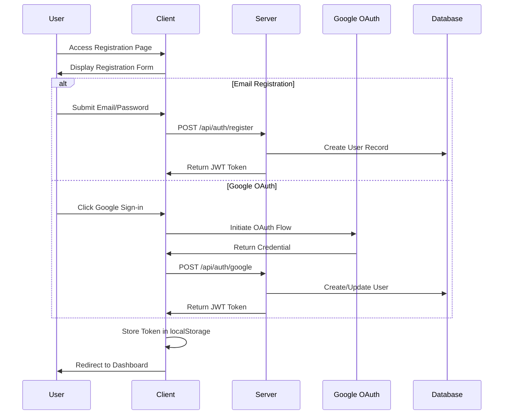
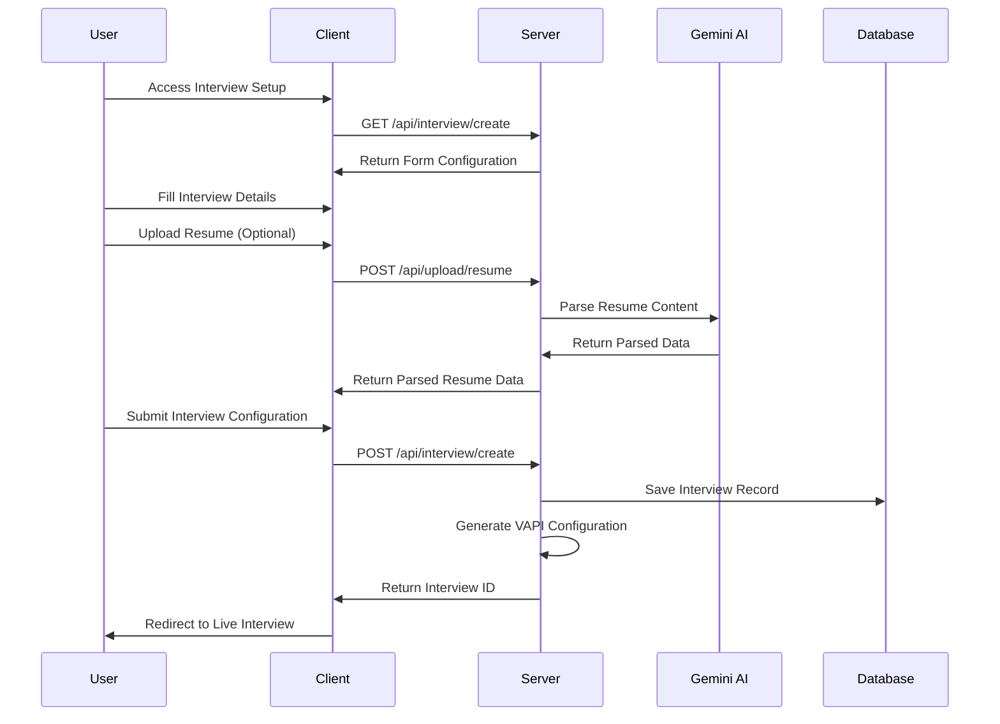
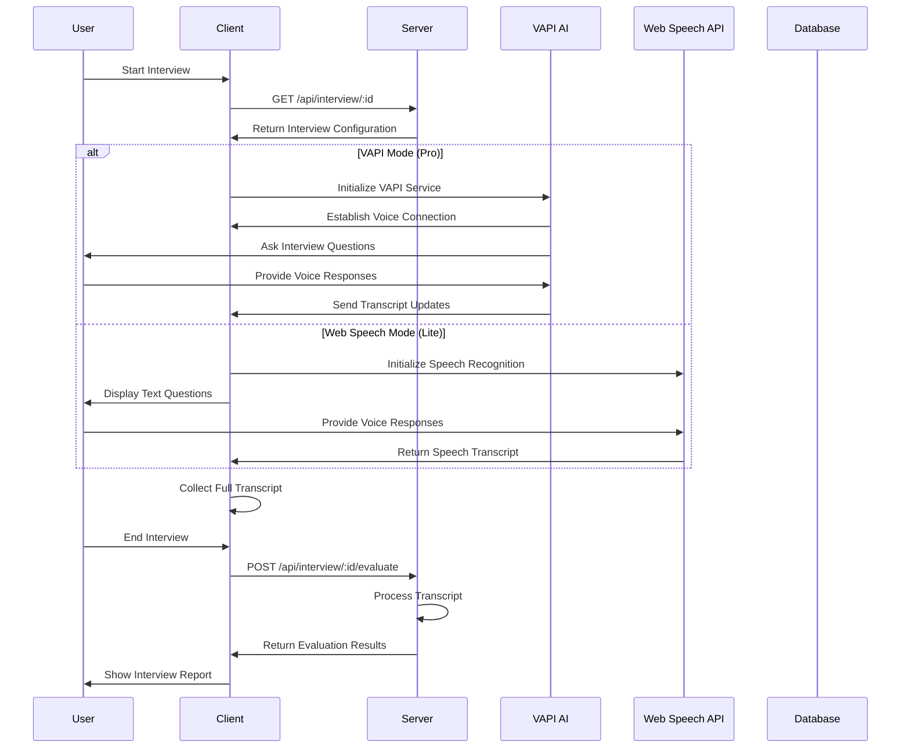
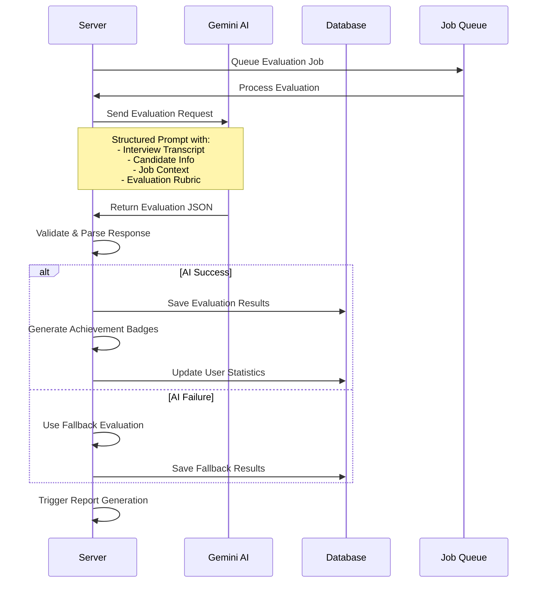

# InterviewMate - System Design & Architecture

## 🏗️ System Architecture Overview

InterviewMate is a full-stack AI-powered interview practice platform built with modern web technologies and microservices architecture principles.

### High-Level Architecture

```
┌─────────────────┐    ┌─────────────────┐    ┌─────────────────┐
│   Client App    │    │   API Gateway   │    │   AI Services   │
│   (React SPA)   │◄──►│  (Express.js)   │◄──►│  (Gemini/VAPI)  │
└─────────────────┘    └─────────────────┘    └─────────────────┘
         │                       │                       │
         │                       │                       │
         ▼                       ▼                       ▼
┌─────────────────┐    ┌─────────────────┐    ┌─────────────────┐
│   CDN/Static    │    │   Database      │    │   File Storage  │
│   (Vercel)      │    │   (MongoDB)     │    │   (Local/S3)    │
└─────────────────┘    └─────────────────┘    └─────────────────┘
```

## 🔧 Technology Stack

### Frontend Stack
```
React 18.2.0
├── Vite (Build Tool)
├── Tailwind CSS (Styling)
├── Framer Motion (Animations)
├── React Router DOM (Routing)
├── Axios (HTTP Client)
├── React Hot Toast (Notifications)
├── Lucide React (Icons)
├── jsPDF (PDF Generation)
└── Recharts (Data Visualization)
```

### Backend Stack
```
Node.js 18+
├── Express.js (Web Framework)
├── MongoDB + Mongoose (Database)
├── JWT (Authentication)
├── bcryptjs (Password Hashing)
├── Google Gemini AI (Evaluation)
├── VAPI AI (Voice Interviews)
├── Razorpay (Payments)
├── Nodemailer (Email)
├── Multer (File Upload)
└── Various Security Middleware
```

### External Services
```
AI & Voice Services
├── Google Gemini AI (Interview Evaluation)
├── VAPI AI (Real-time Voice Conversations)
└── Web Speech API (Browser Speech Recognition)

Authentication & Payments
├── Google OAuth 2.0
├── Razorpay Payment Gateway
└── JWT Token Management

Infrastructure
├── MongoDB Atlas (Database)
├── Vercel/Netlify (Frontend Hosting)
├── Railway/Render (Backend Hosting)
└── Gmail SMTP (Email Service)
```

## 🏛️ System Components

### 1. Frontend Architecture

```
src/
├── components/           # Reusable UI Components
│   ├── InterviewSetup/  # Interview configuration
│   ├── Reports/         # Report generation & display
│   ├── Layout/          # Layout components
│   └── Common/          # Shared components
├── pages/               # Route-based page components
├── contexts/            # React Context for state management
├── services/            # API communication & external services
├── utils/               # Utility functions
├── constants/           # Application constants
└── hooks/               # Custom React hooks
```

#### Component Hierarchy
```
App
├── AuthProvider (Context)
├── InterviewProvider (Context)
├── Router
    ├── Public Routes
    │   ├── LandingPage
    │   ├── LoginPage (with GoogleOAuth)
    │   └── RegisterPage
    └── Protected Routes
        ├── Dashboard
        ├── InterviewSetup
        ├── LiveInterview
        ├── InterviewReport
        ├── InterviewHistory
        ├── Analytics
        └── Profile/Settings
```

### 2. Backend Architecture

```
server/
├── routes/              # API route handlers
│   ├── auth.js         # Authentication endpoints
│   ├── interview.js    # Interview management
│   ├── user.js         # User management
│   ├── payment.js      # Payment processing
│   └── admin.js        # Admin operations
├── models/              # MongoDB data models
├── middleware/          # Express middleware
├── config/              # Configuration files
├── services/            # Business logic services
└── utils/               # Utility functions
```

#### API Architecture
```
Express App
├── Security Middleware
│   ├── Helmet (Security Headers)
│   ├── CORS (Cross-Origin)
│   ├── Rate Limiting
│   └── Input Sanitization
├── Authentication Middleware
│   ├── JWT Verification
│   └── User Authorization
├── Route Handlers
│   ├── /api/auth/*
│   ├── /api/user/*
│   ├── /api/interview/*
│   ├── /api/payment/*
│   └── /api/admin/*
└── Error Handling
    ├── 404 Handler
    └── Global Error Handler
```

## 🔄 Process Flow

### 1. User Registration & Authentication Flow



### 2. Interview Setup Flow



### 3. Live Interview Flow



### 4. AI Evaluation Flow



## 📊 Data Flow

### 1. Authentication Data Flow

```
User Input → Client Validation → API Request → Server Validation → Database Query → JWT Generation → Client Storage → Protected Routes Access
```

### 2. Interview Data Flow

```
Setup Form → File Upload → AI Processing → Database Storage → Live Session → Transcript Collection → AI Evaluation → Report Generation → User Dashboard
```

### 3. Payment Data Flow

```
Plan Selection → Razorpay Integration → Payment Processing → Webhook Verification → Database Update → User Balance Update → Feature Access
```

## 🗄️ Database Design

### MongoDB Collections Structure

#### 1. Users Collection
```javascript
{
  _id: ObjectId,
  name: String,
  email: String (unique, indexed),
  password: String (hashed),
  googleId: String (sparse index),
  profilePicture: String,
  
  subscription: {
    plan: String, // 'free' | 'pro'
    vapiMinutesRemaining: Number,
    vapiMinutesUsed: Number,
    payAsYouGoBalance: Number,
    renewalDate: Date,
    razorpayCustomerId: String,
    razorpaySubscriptionId: String,
    lastPayment: {
      amount: Number,
      date: Date,
      razorpayPaymentId: String,
      status: String
    }
  },
  
  preferences: {
    theme: String, // 'light' | 'dark'
    notifications: {
      email: Boolean,
      push: Boolean
    },
    language: String
  },
  
  stats: {
    totalInterviews: Number,
    totalMinutesUsed: Number,
    averageScore: Number,
    lastInterviewDate: Date
  },
  
  isActive: Boolean,
  isAdmin: Boolean,
  emailVerified: Boolean,
  emailVerificationToken: String,
  passwordResetToken: String,
  passwordResetExpires: Date,
  
  createdAt: Date,
  updatedAt: Date
}
```

#### 2. Interviews Collection
```javascript
{
  _id: ObjectId,
  userId: ObjectId (indexed, ref: 'User'),
  type: String, // 'hr' | 'technical' | 'managerial' | 'custom'
  status: String, // 'created' | 'in_progress' | 'completed' | 'cancelled'
  
  candidateInfo: {
    name: String,
    role: String,
    company: String,
    experience: String, // 'fresher' | 'mid-level' | 'senior' | 'executive'
    skills: [String],
    resume: {
      filename: String,
      path: String,
      uploadDate: Date
    },
    jobDescription: {
      filename: String,
      path: String,
      uploadDate: Date
    }
  },
  
  configuration: {
    duration: Number, // minutes
    difficulty: String, // 'easy' | 'medium' | 'hard'
    topics: [String],
    customTopics: [String],
    customQuestions: [String],
    jobDescription: String,
    language: String,
    interviewMode: String, // 'webspeech' | 'vapi'
    numQuestions: Number
  },
  
  vapiConfig: {
    assistantId: String,
    callId: String,
    firstMessage: String,
    systemPrompt: String,
    voice: {
      provider: String,
      voiceId: String
    }
  },
  
  session: {
    startTime: Date,
    endTime: Date,
    actualDuration: Number, // minutes
    transcript: String,
    recording: {
      url: String,
      duration: Number
    }
  },
  
  evaluation: {
    overallScore: Number, // 0-100
    skillScores: {
      communication: Number,
      technicalKnowledge: Number,
      problemSolving: Number,
      confidence: Number,
      clarity: Number,
      behavioral: Number
    },
    strengths: [String],
    weaknesses: [String],
    recommendations: [String],
    detailedFeedback: String,
    badges: [String],
    evaluatedAt: Date,
    evaluationModel: String
  },
  
  analytics: {
    speakingTime: Number,
    pauseCount: Number,
    averagePauseLength: Number,
    wordsPerMinute: Number,
    sentimentScore: Number,
    keywordMatches: [String]
  },
  
  feedback: {
    userRating: Number, // 1-5
    userComments: String,
    reportGenerated: Boolean,
    reportUrl: String,
    sharedOn: [String]
  },
  
  metadata: {
    ipAddress: String,
    userAgent: String,
    deviceType: String,
    browserInfo: String
  },
  
  createdAt: Date,
  updatedAt: Date
}
```

#### 3. Payments Collection
```javascript
{
  _id: ObjectId,
  userId: ObjectId (indexed, ref: 'User'),
  razorpayOrderId: String (indexed),
  razorpayPaymentId: String (indexed),
  razorpaySignature: String,
  
  amount: Number, // in paise
  currency: String,
  status: String, // 'created' | 'paid' | 'failed' | 'refunded'
  
  planType: String, // 'minutes' | 'subscription'
  minutesPurchased: Number,
  
  metadata: {
    ipAddress: String,
    userAgent: String
  },
  
  createdAt: Date,
  updatedAt: Date
}
```

#### 4. Reports Collection
```javascript
{
  _id: ObjectId,
  interviewId: ObjectId (indexed, ref: 'Interview'),
  userId: ObjectId (indexed, ref: 'User'),
  
  reportData: {
    candidateInfo: Object,
    interviewType: String,
    overallScore: Number,
    skillBreakdown: Object,
    strengths: [String],
    weaknesses: [String],
    recommendations: [String],
    badges: [String]
  },
  
  pdfUrl: String,
  publicUrl: String,
  shareCount: Number,
  
  createdAt: Date,
  updatedAt: Date
}
```

#### 5. Ledger Collection (for audit trail)
```javascript
{
  _id: ObjectId,
  userId: ObjectId (indexed, ref: 'User'),
  transactionType: String, // 'credit' | 'debit' | 'refund'
  
  amount: Number, // minutes or money
  description: String,
  
  relatedPaymentId: ObjectId,
  relatedInterviewId: ObjectId,
  
  balanceBefore: Number,
  balanceAfter: Number,
  
  createdAt: Date
}
```

### Database Indexes

```javascript
// Users Collection Indexes
db.users.createIndex({ email: 1 }, { unique: true })
db.users.createIndex({ googleId: 1 }, { unique: true, sparse: true })
db.users.createIndex({ createdAt: -1 })
db.users.createIndex({ isActive: 1 })
db.users.createIndex({ "subscription.plan": 1 })

// Interviews Collection Indexes
db.interviews.createIndex({ userId: 1, createdAt: -1 })
db.interviews.createIndex({ type: 1 })
db.interviews.createIndex({ status: 1 })
db.interviews.createIndex({ "evaluation.overallScore": -1 })
db.interviews.createIndex({ userId: 1, status: 1 })

// Payments Collection Indexes
db.payments.createIndex({ userId: 1, createdAt: -1 })
db.payments.createIndex({ razorpayOrderId: 1 }, { unique: true })
db.payments.createIndex({ razorpayPaymentId: 1 }, { unique: true, sparse: true })
db.payments.createIndex({ status: 1 })

// Reports Collection Indexes
db.reports.createIndex({ interviewId: 1 }, { unique: true })
db.reports.createIndex({ userId: 1, createdAt: -1 })
db.reports.createIndex({ publicUrl: 1 }, { sparse: true })

// Ledger Collection Indexes
db.ledger.createIndex({ userId: 1, createdAt: -1 })
db.ledger.createIndex({ transactionType: 1 })
db.ledger.createIndex({ relatedPaymentId: 1 }, { sparse: true })
```

## 🔐 Security Architecture

### 1. Authentication & Authorization

```
JWT Token Flow:
1. User Login → Server validates credentials
2. Server generates JWT with user payload
3. Client stores JWT in localStorage
4. Client sends JWT in Authorization header
5. Server validates JWT on protected routes
6. Server extracts user info from JWT payload
```

### 2. Data Protection

```
Input Validation:
├── Client-side validation (immediate feedback)
├── Server-side validation (express-validator)
├── MongoDB schema validation (Mongoose)
└── Sanitization (mongo-sanitize, xss-clean)

Password Security:
├── bcryptjs hashing (12 salt rounds)
├── Password strength requirements
└── Secure password reset flow
```

### 3. API Security

```
Security Middleware Stack:
├── Helmet (Security headers)
├── CORS (Cross-origin protection)
├── Rate Limiting (Prevent abuse)
├── HPP (HTTP Parameter Pollution)
├── Express Mongo Sanitize
└── XSS Clean
```

## 🚀 Deployment Architecture

### Production Environment

```
Frontend (Vercel/Netlify):
├── React SPA Build
├── Static Asset Optimization
├── CDN Distribution
├── Custom Domain + SSL
└── Environment Variables

Backend (Railway/Render):
├── Node.js Server
├── Auto-scaling
├── Health Checks
├── Log Aggregation
└── Environment Variables

Database (MongoDB Atlas):
├── Replica Set
├── Automated Backups
├── Performance Monitoring
└── Security Features
```

### CI/CD Pipeline

```
GitHub Actions:
├── Code Quality Checks
├── Security Scanning
├── Automated Testing
├── Build Process
├── Deployment to Staging
└── Production Deployment
```

## 📈 Performance Optimization

### Frontend Optimization

```
React Optimization:
├── Code Splitting (React.lazy)
├── Memoization (React.memo, useMemo)
├── Virtual Scrolling (large lists)
├── Image Optimization
└── Bundle Analysis

Caching Strategy:
├── Browser Caching
├── Service Worker (PWA)
├── API Response Caching
└── Static Asset Caching
```

### Backend Optimization

```
Database Optimization:
├── Proper Indexing
├── Query Optimization
├── Connection Pooling
├── Aggregation Pipelines
└── Data Archiving

API Optimization:
├── Response Compression
├── Pagination
├── Field Selection
├── Caching Headers
└── Rate Limiting
```

## 🔍 Monitoring & Analytics

### Application Monitoring

```
Health Checks:
├── /api/health endpoint
├── Database connectivity
├── External service status
└── Resource utilization

Error Tracking:
├── Sentry integration
├── Error logging
├── Performance monitoring
└── User session tracking
```

### Business Analytics

```
User Analytics:
├── Registration funnel
├── Interview completion rates
├── Feature usage patterns
└── User retention metrics

Performance Analytics:
├── API response times
├── Database query performance
├── AI service latency
└── Payment success rates
```

This comprehensive system design provides a complete overview of the InterviewMate platform's architecture, data flow, and technical implementation details.